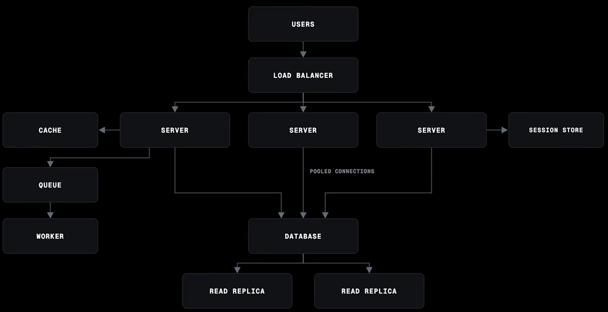

# System-Design-Architecture by js-mastery

**Youtube Reference:** https://www.youtube.com/watch?v=EaXHfuHRWwg

---

### Multi Server Architecture
Copy of your same site on multiple servers to handle many users concurrently.

### Load Balancer
Load Balancer will decide, which user will reach to which server.

### Sessions
Redis Session Storage is used to communicate between multiple sessions. 
**Example:** user logged in with server1 and forgot password request sent to server2, the session will be used to check if the user is logged in or not.

### Database Pooled Connection
Multiple Servers can interact with the same database concurrently

### Database Read Replica
Most of the queries for Database are of `READ`, so we create copies of database which are replicas to each other.
**Example:** you are only scrolling reels, the posting of reals is too much low. The read replicas is used to fetch your trending feed reels that you can scroll. When you create a post, it will be stored into database and after some time the read replicas will update.

### Cache
Same request gets cached with Redis so that the database load is minimized.

### Queues & Workers
For asynchronous tasks, we create Redis Queues (BullMQ). 
**Example:** user logged in and a queue job is created for email verification, we said user is authenticated, even when the verification is not done yet… The time of signup reduce significantly: 

* **Before:** login/signup + Email verification = 40s
* **After:** login/singup = 5s -> user authenticated
           |-> Asynchronous Email Verification = 35s 

1. If verified: user is already authenticated
2. if not give an error and retry again.