# System-Design-Architecture by js-mastery

**JS Mastery Youtube Reference:** https://www.youtube.com/watch?v=EaXHfuHRWwg 

**System Design Projects:** https://github.com/liquidslr/system-design-notes

---

### Multi Server Architecture:
    Copy of your same site on multiple servers to handle many users concurrently.
1. **Vertical Scaling:** increase Ram, Storage, Memory of the existing server
2. **Horizontal Scaling:** increase the no. of servers to handle the load

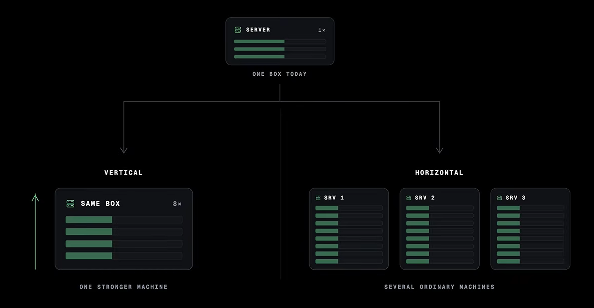

### Load Balancer:
    Load Balancer will decide, which user will reach to which server.
    
    Analogy: "Ek counter pe 1000 log nahi - 10 counters pe 100-100 log" 
    (Not 1000 people at one counter - 100 people at 10 counters)

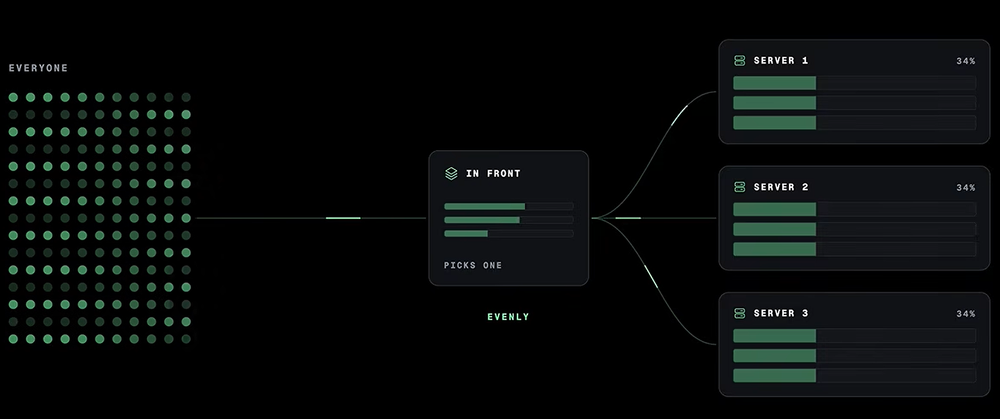

### Microservices Architecture:
    When you create multiple FastAPI backends/services, each responsible for a particular domain or workload so they can be independently scaled and deployed, the architecture is generally called microservices architecture.

    For example:

                        API Gateway
                             │
              ┌──────────────┼──────────────┐
              ▼              ▼              ▼
         User Service    AI Service     Report Service
           FastAPI         FastAPI          FastAPI
              │              │                │
              ▼              ▼                ▼
           Database       GPU/LLM          Database

### API Gateway:
    Single entry point for all requests. route request to correct microservice.
    Handles Rate limiting, authentication, and routing.
    
    Analogy: "Building ka security guard - sab iske through aate hain"
    (Building's security guard - everyone comes through this)

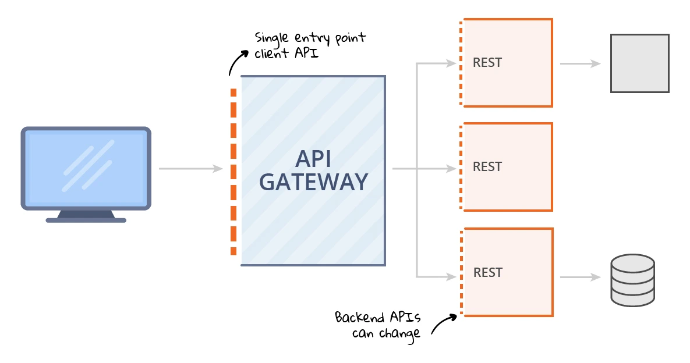

### Sessions:
    Redis Session Storage is used to communicate between multiple sessions. 

    Example: user logged in with server1 and forgot password request sent to server2, the session will be used to check if the user is logged in or not.

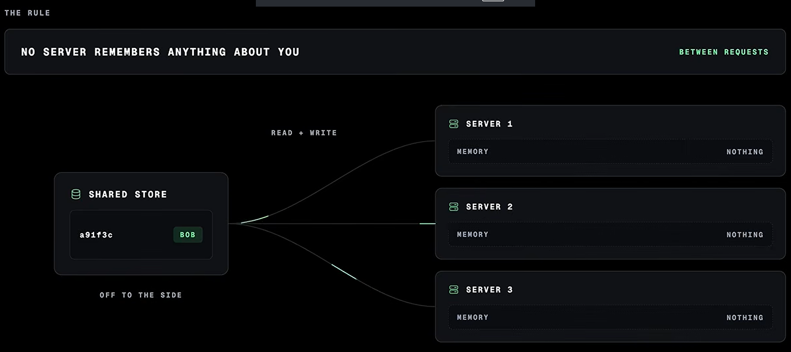

### Database Pooled Connection:
    Multiple Servers can interact with the same database concurrently

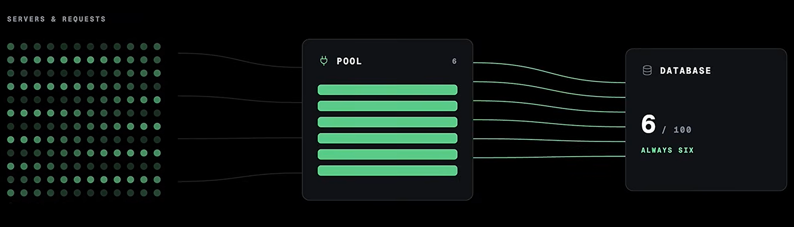

### Database: SQL vs NoSQL
    SQL: Structured, relationships, ACID compliance.
    NoSQL: Flexible, scale, speed.
    
    Note: "Ye BIGGEST trade-off hai - isko samajh le"
    (This is the BIGGEST trade-off - understand this)

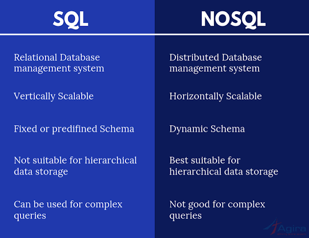
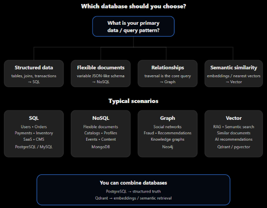

### Database Read Replica:
    Most of the queries for Database are of `READ`, so we create copies of database which are replicas to each other.
    
    Example: you are only scrolling reels, the posting of reals is too much low. The read replicas is used to fetch your trending feed reels that you can scroll. When you create a post, it will be stored into database and after some time the read replicas will update.

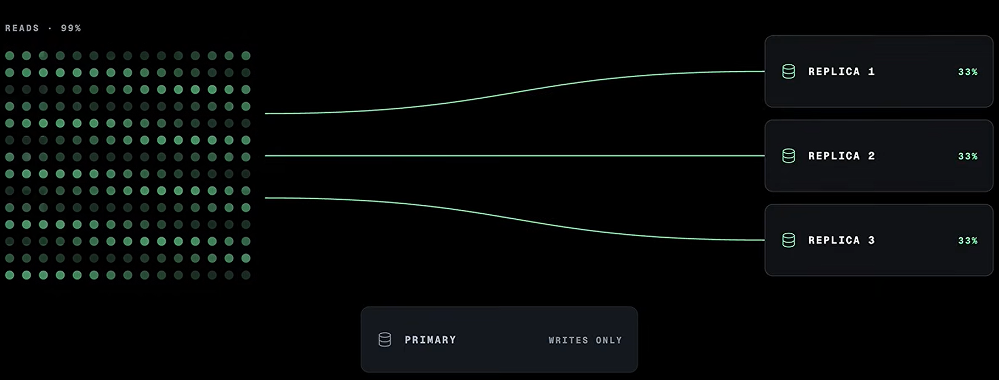

### Sharding / Partitioning:
    Database split karo by user ID, region, etc.
    
    Analogy: "Ek almaari mein sab mat rakh - 10 almaariyaan bana"
    (Don't put everything in one cupboard - make 10 cupboards)

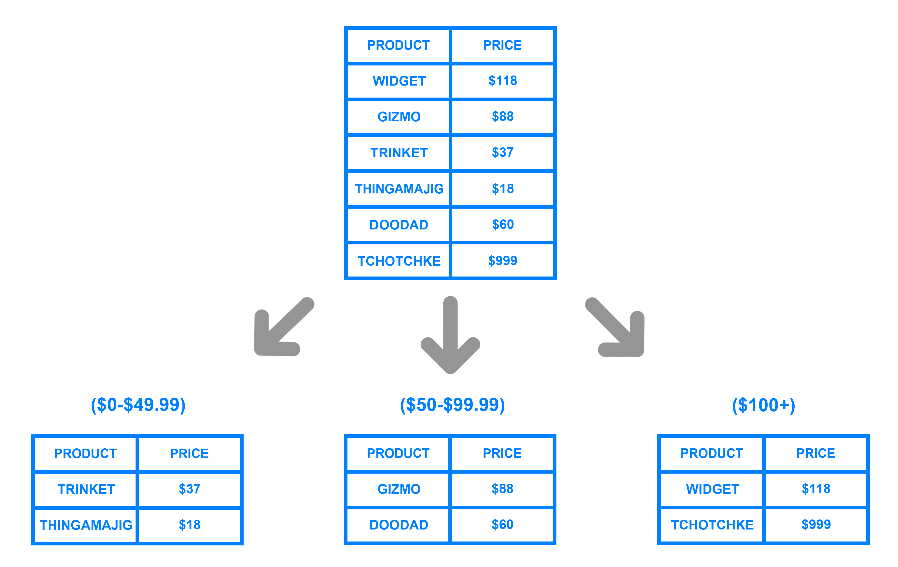

### Caching:
    Same request gets cached with Redis (or Memcached) so that the database load is minimized.
    
    Analogy: "Baar baar fridge kholne ki jagah table pe rakh le"
    (Instead of opening the fridge again and again, keep it on the table)

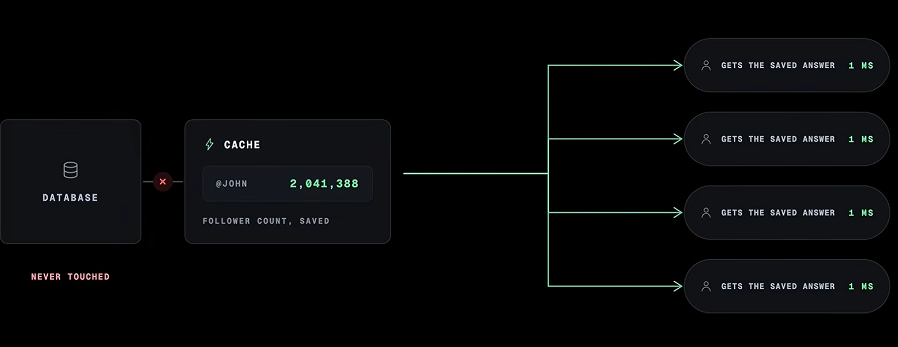

### CDN (Content Delivery Network):
    Static files (images/videos) are delivered from a server geographically closer to the user.
    
    Analogy: "Amazon warehouse har city mein hota hai - delivery fast hoti hai"
    (Amazon has a warehouse in every city - delivery is fast)

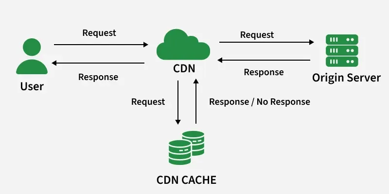

### Queues & Workers:
    For asynchronous tasks, we create Redis Queues (BullMQ) or Message Queues (Kafka/RabbitMQ). 
    
    Example: user logged in and a queue job is created for email verification, we said user is authenticated, even when the verification is not done yet… The time of signup reduce significantly: 

     Before: login/signup + Email verification = 40s
     After: login/singup = 5s -> user authenticated
            |-> Asynchronous Email Verification = 35s 

    1. If verified: user is already authenticated
    2. if not give an error and retry sending email verification.

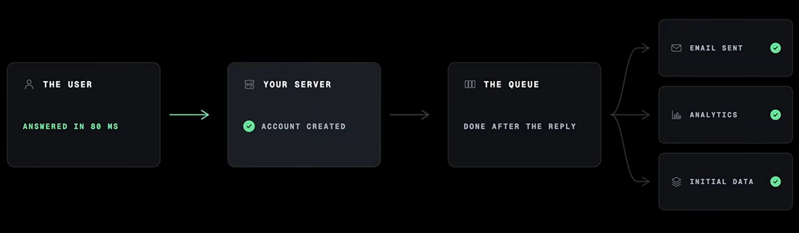